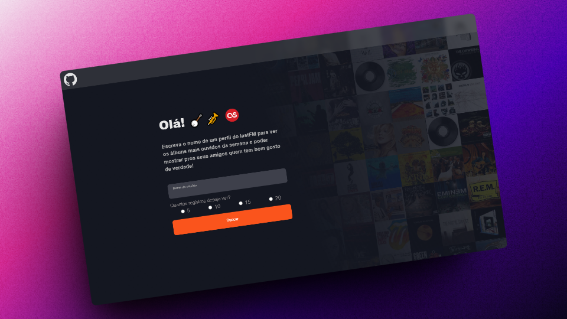
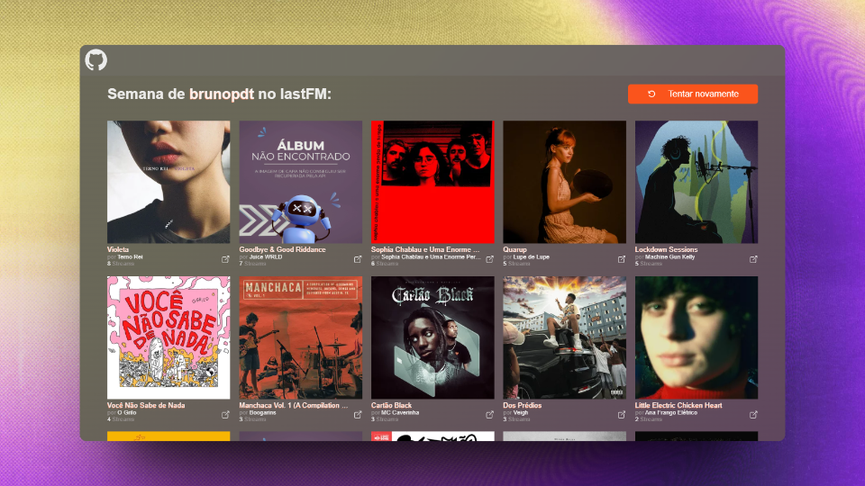

# Semaninha do Last.fm

https://last-fm-blue.vercel.app

Bem-vindo ao Semaninha do Last.fm! Este é um website completamente responsivo que permite aos usuários visualizarem seus dados de audição musical do Last.fm durante a semana atual. Os usuários podem simplesmente digitar seu nome de usuário do Last.fm e escolher quantos registros desejam ver da semana para ver o que mais scrobblaram!

## Funcionalidades

- Visualização dos álbuns e artistas mais scrobblados durante a semana atual no Last.fm, além da quantidade de streams no período.
- Opção de escolher quantos registros deseja ver (5, 10, 15 ou 20).
- Integração com as APIs do Last.fm para obter os dados de audição atualizados.
- Interface intuitiva para uma experiência de usuário agradável.
- Responsividade para todos os tipos de telas (computador, notebook, tablets e celulares)

## Como usar

1. Acesse o website do Semaninha (disponível em: https://last-fm-blue.vercel.app)
2. Digite o seu nome de usuário do Last.fm no campo designado.
3. Escolha o número de registros que deseja visualizar na semana.
4. Clique no botão "Buscar" para ver os resultados.
5. Caso queira tentar novamente vendo mais registros, ou buscar outro usuário, clique em "Tentar Novamente" para voltar à tela inicial.
6. Para visitar o repositório do projeto no github, apenas clique no ícone na NavBar que você será redirecionado para ele.

## Tecnologias utilizadas

- React + Vite
- Vercel
- CSS
- Postman
- API do LastFM: user.getWeeklyAlbumChart
- API do LastFM: album.getInfo

## Contato

Se você tiver alguma dúvida ou sugestão relacionada a este projeto, entre em contato comigo! Informações de contato disponíveis no meu perfil do GitHub.
